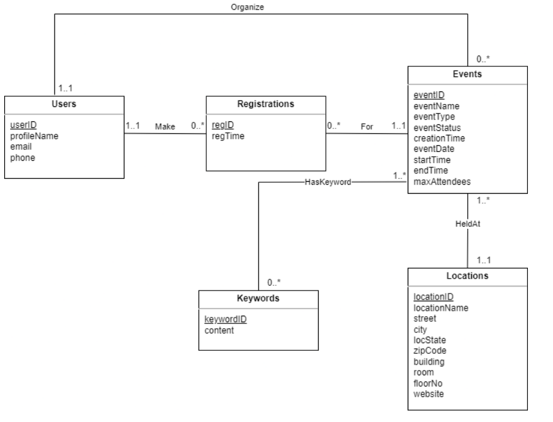

<h1 align="center">
   
  Event Registration and Management Database
   
</h1>

<h4 align="center">An all-in-one database design that allows users to find, organize, and register for events.</h4>

<em>This database system was developed independently as my final project for <strong>CS-432: Database Systems</strong> at <strong>Monmouth University</strong> during the <strong>Spring 2023</strong> semester.</em>

  <a href="#database-design">Database Design</a> •
  <a href="#database-contents">Database Contents</a> •
  <a href="#key-features">Key Features</a>

## Database Design

- Six tables
  - Users
  - Registrations
  - Events
  - Keywords
  - Locations
  - HasKeyword
- One trigger
  - Automatically updates an event's status to "closed" after it becomes full (i.e., reaches its max attendee count)

  
   
  <em>UML diagram</em>

## Database Contents

- 20 unique users
- 10 unique event locations
- 12 unique events
- 22 unique event registrations
- 29 unique keywords

## Key Features

- Find events
  - Search by keyword, event type, and/or date
- Register for events
- Create/organize events
- Associate keywords to events
- View/manage event registrations and attendees
- Event auto-closing
  - An event is automatically closed via database trigger after it reaches its max attendee count
